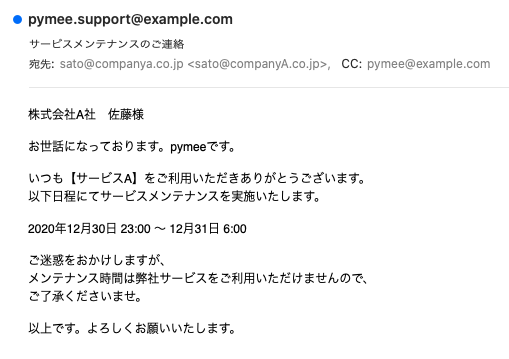
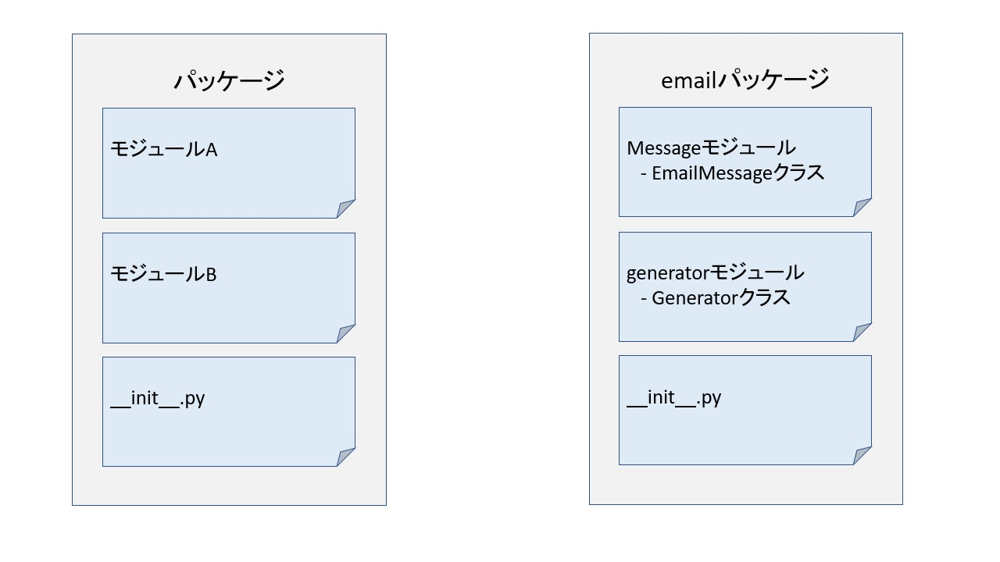
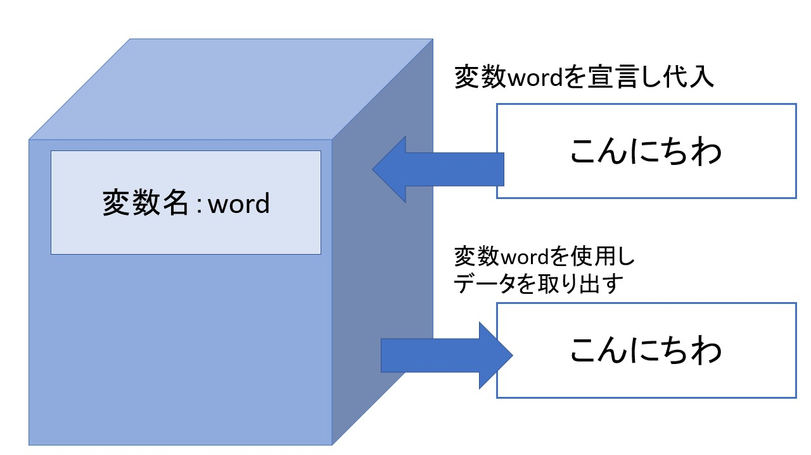
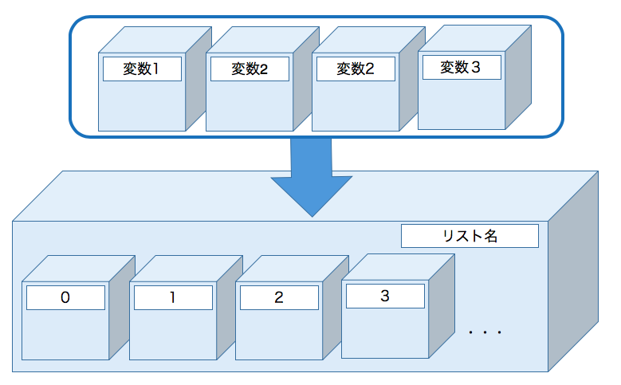

<!--
class: title
-->

# pymee勉強会
### メール作成の自動化

---

<!--
class: slide
-->

# 事前準備
</br>

勉強会開始までもう少々お待ちください・・・
お待ち頂いている間に以下の確認をお願いします

- 確認事項
  以下3点が完了しているか確認をお願いします

  1. python3のインストール
  2. メーラーのインストール
  3. 勉強会資料のダウンロード
</br>

- 注意事項
  勉強会の内容はzoomで録画させて頂きます
  録画した内容は後日公開予定になります


---

# 勉強会について

- 目的
プログラムに興味を持ってもらう
身近な業務である**メール作成業務の自動化**をテーマに！

- 勉強会の流れ
  - 勉強会＆課題の提示
  - 各自課題対応(2ヶ月)
  - 懇親会@zoom にてプログラムの発表

- お願い
 tocaroのチャットに思ったことや疑問点の投稿をお願いします！
 「へー」とか、「ふーん」とかでもOKです笑

---

# メール作成業務の自動化について①
株式会社pymeeのサービスを運用しており、サービスメンテナンスにより特定の時間帯にサービスが利用できなくなります

サービスメンテナンスを実施する前に、サービスが停止する時間帯をメールにてユーザへ連絡する必要があります

ユーザ数は100名です

ユーザへの通知まで時間がある為、事前にメール(emlファイル)を作成することになりました

---

# メール作成業務の自動化について②
</br>
</br>
</br>

  - csvファイル (中身は宛先アドレス,CC,会社名,宛名の順)

    | |
    | :--: |

  - メールフォーマット

    | |
    | :--: |

---

<!--
class: title
-->
## 実際にプログラムでメールを作成してみます！

---

<!--
class: slide
-->

# アジェンダ
- プログラムって何？
- 自動化する前に業務の自動化を考えてみる
- `1通のメールを作成するプログラムを実行してみる`
- `1通のメールを作成するプログラムを修正してみる`
- csvファイルからデータを読み込む
- 今後の流れについて

</br>
灰色部分が実際に手を動かしてもらう部分になります

---

# プログラムって何？

</br>

- コンピュータにやってもらいたい処理を書いて指示すること
- 指示内容について書いたものが「プログラム」
  - 指示内容を記載する言葉が「プログラミング言語」
  - プログラムを実行するには「実行環境」が必要
  - 一般的にプログラムを書くことを「プログラミング」という


**プログラミング言語の文法に則り、コンピュータへの指示書を作成し、処理を依頼すること**

---

# プログラムも万能ではない・・・
- プログラムは指示書
  - 手順、明確な判断基準がないと想定通りに動いてくれない
  - 人間のように融通がきいた判断がつかない
</br>

- 繰り返し処理が得意
  - 人間のように疲れることはない

---

# 問題：プログラムを書く前に

**自動化する業務を整理する必要があります**

> - プログラムは指示書
>    - 手順、明確な判断基準がないと想定通りに動いてくれない
>    - 人間のように融通がきいた判断がつかない

</br>
そもそも、人が対応した場合の手順を考えてみよう！

- スライド「メール作成業務の自動化について①、②」から人が対応した場合の手順を考えてみてください
- もし良ければ、考えた結果をtocaroのチャットに投稿してみてください〜

---

# 手順例
</br>

1. csvファイルを開く
1. メールを新規作成する
1. csvファイルの宛先をコピーしてメールの宛先に貼り付ける
1. csvファイルのCCをコピーしてメールのCCに貼り付ける
1. 件名を入力する
1. 本文をコピーして貼り付ける
1. csvファイルの会社名をコピーし本文の<会社名>の部分と置き換える
1. csvファイルの宛名をコピーし本文の<宛名>の部分と置き換える
1. サービスメンテナンスのご連絡_<会社名>_<宛名>.emlの名前で保存する
1. csvの終わりまで手順2〜9を繰り返す

---

# 進め方
いきなりプログラムを書くのではなく、以下のように段階的に作成していきます

1. メール1通を作成するプログラムを実行してみる
2. メール1通を作成するプログラムを修正してみる
3. csvファイルからデータを取り出すプログラムを修正してみる
4. csvファイルからデータを取り出し、複数メールを作成するプログラムを作ってみる

---

# 問題：メール1通を作成するプログラムの実行
</br>
</br>
</br>

1. メールが格納されるフォルダ「result」を「mail_create1_example.py」と同じ階層に作成
2. 以下どちらかの方法でプログラムを実行

    - Windowsの実行方法
      ```
      $ py mail_create_1_example.py
      ```
    - Mac/Linuxの実行方法
      ```
      $ python3 mail_create_1_example.py
      ```
      Mac/Linuxでは「python mail_create_1_example.py」でも実行できますが、python2で実行される可能性がるため上記方法で実行します

---

# 問題：メール1通を作成するプログラムの実行
</br>
</br>
</br>
</br>

3. 結果の確認
    - コンソールに以下が出力。**※本文は読めない形式で出力**
      
    - 「result」フォルダにメールが作成されること
      

---

# プログラムの中身をみてみよう
テキストエディタで以下のファイルを開いてみてください
- ファイル名:mail_create_1_example.py

---

<!--
class: code-main
-->

# 処理の大まかな流れ

1. メールデータ作成機能の呼び出し
    ```python
    from email.message import EmailMessage
    from email.generator import Generator
    ```

2. ファイルに書き込むためのメールデータの準備
    ```python
    # 変数の設定
    # 送信元、宛先、CCのメールアドレスを変数で定義してメールを作成してみよう！
    subject = 'サービスメンテナンスのご連絡'

    (中略)

    # 本文を設定する
    mail_data.set_content(message)
    ```

3. emlファイルへの書き込み
    ```python
    # 設定した内容をファイルに書き込む
    with open('result/サービスメンテナンスのご連絡_<会社名>_<宛名>.eml'.replace('<会社名>',
    company).replace('<宛名>',name), 'w') as eml:
        eml_file = Generator(eml)
        eml_file.flatten(mail_data)
    ```

---

<!--
class: slide
-->

# メールデータ作成機能の呼び出し

EmailMessage機能とGenerator機能を呼び出しています
  - EmailMessageでメールデータの作成/編集/読み込みができます
  - Generatorでファイルへのメールデータの書き込みができます

以下のように呼び出しを行わないと、機能を使用することができません

```python
from email.message import EmailMessage
from email.generator import Generator
```


- 呼び出し部分を詳しくみると・・・
  emailパッケージのmessageモジュールからEmailMessage機能を、emailパッケージのgeneratorモジュールからGenerator機能を呼び出しています

---

# パッケージとモジュールとは？
</br>
</br>
</br>

モジュールとはpythonのプログラムファイル(.py)のこと
複数のモジュールをまとめたものをパッケージといいます



---

# メールデータの準備(変数について)
</br>
</br>
</br>

メール作成に必要な文字列を変数に代入しています

```python
# 変数の設定
# 送信元、宛先、CCのメールアドレス、会社名、宛名を変数で定義してメールを作成してみよう！
subject = 'サービスメンテナンスのご連絡'
company = '株式会社A'
name = '佐藤'
```

- 変数とは？
  ラベルがついた箱のようなもの、データを格納することができます

  

---

# メールデータの準備(変数について)

- 変数の宣言
  以下のようにして変数を宣言することで、それ以降は変数を使用することができます

  ```
  変数名 = データ
  ```

- データについて
  データには種類(型)があり、種類によって宣言の方法が異なります
  文字列は「'」もしくは「"」で文字列を囲む必要があります

  ```python
  # 変数の設定
  # 送信元、宛先、CCのメールアドレス、会社名、宛名を変数で定義してメールを作成してみよう！
  subject = 'サービスメンテナンスのご連絡'
  company = '株式会社A'
  name = '佐藤'
  ```

---

# メールデータの準備(変数について)
</br>

- 文字列が複数行ある場合、文字列を"""で囲むやり方があります
  以下では、変数messageにメール本文を代入しています

  ```python
  # <会社名>と<宛名>の部分を関数で書き換えてみよう
  message = """<会社名>　<宛名>様

  お世話になっております。pymeeです。

  いつも【サービスA】をご利用いただきありがとうございます。
  以下日程にてサービスメンテナンスを実施いたします。

  2020年12月30日 23:00 〜 12月31日 6:00

  ご迷惑をおかけしますが、
  メンテナンス時間は弊社サービスをご利用いただけませんので、
  ご了承くださいませ。

  以上です。よろしくお願いいたします。
  """
  ```

---

# メールのデータ作成の前に・・・
</br>
</br>
</br>

メールメッセージのデータはテキストでできており、フォーマットがあります

- ヘッダ部のには以下のような情報を記載
  - From:に送信元メールアドレス
  - To:に宛先メールアドレス
  - CC:にCCのメールアドレス
  - subject:に件名
- ボディ部には本文を記載


---

# メールデータの準備
</br>

EmailMessageを使用し、メールデータを作成するための大きな箱を準備します
その大きな箱を変数mail_dataに代入しています

```python
# メールを作成する
mail_data = EmailMessage()
```
箱には送信元メールアドレス、宛先メールアドレス等の情報を格納が可能です
以下の方法で各フィールドにデータを格納します
```
mail_data['フィールド名']=データ
```

---

# メールデータの準備
</br>

各フィールドへ値を格納します
件名は先ほど宣言した変数subjectを使用します
メールの本文は、set_content()の括弧の中に変数messageを入れることで格納できます

```python
# 送信元アドレスを設定する
mail_data['From'] = '送信元メールアドレス'

# 宛先アドレスを設定する
mail_data['To'] = '宛先メールアドレス'

# CCアドレスを設定する
mail_data['CC'] = 'CCのメールアドレス'

# 件名を設定する
mail_data['subject'] = subject

# 本文を設定する
mail_data.set_content(message)
```

---

# メールデータの確認　
</br>
</br>
</br>

- 標準出力(コマンドプロンプト/コンソール)にmail_dataの中身を表示させています(print()はデータを標準出力へ表示させる関数)

  ```python
  # mail_dataの中身をみてみる
  print(mail_data)
  ```
- 出力結果


---

# emlファイルへの書き込み
</br>
</br>
</br>

以下の処理を行なっています
  - replace関数でファイル名を置換
  - emlファイルを開く
  - mail_dataをemlファイルに書き込む

```python
with open('result/サービスメンテナンスのご連絡_<会社名>_<宛名>.eml'.replace('<会社名>',
company).replace('<宛名>',name), 'w') as eml:
    eml_file = Generator(eml)
    eml_file.flatten(mail_data)
```
replace関数を使用し、ファイル名の<会社名>を変数companyのデータ、 <宛名>を変数nameのデータに置き換えています

  - 置換前
    'result/サービスメンテナンスのご連絡_<会社名>_<宛名>.eml'

  - 置換後
    'result/サービスメンテナンスのご連絡_株式会社A_佐藤.eml'

---

# replace関数
関数とは、特定の機能をもつプログラムの塊です

replace関数は文字を置き換える機能を持ち以下のように使用します

```
# 使用方法
変換対象の文字列.replace(変換前, 変換後)

# 実際の使用方法
'result/サービスメンテナンスのご連絡_<会社名>_<宛名>.eml'.replace('<会社名>',company).replace('<宛名>',name)
```

</br>
</br>

- 関数について
  - ()の中を引数といいます
  - 関数を実行した際に返される値を戻り値といいます
  - 色々な機能を持つ関数があります

---

# emlファイルへの書き込み
</br>
</br>

open関数でemlファイルを書き込み可能な状態で開き、それを変数emlとして定義しています

```python
with open('result/サービスメンテナンスのご連絡_<会社名>_<宛名>.eml'.replace('<会社名>',
company).replace('<宛名>',name), 'w') as eml:
    eml_file = Generator(eml)
    eml_file.flatten(mail_data)
```

- open関数について
  ```
  open(ファイル, ファイルを開くモード)
  # ファイルではパスを含めて指定します
  # モードには読み込み(r)、書き込み(w)、追記(a)、排他(x)などがあります
  ```

- 変数emlの有効な範囲について
  インデントを使用しwithの有効範囲を決めています
  この範囲内であれば使用することが可能です

---

# withを使用せずにファイルを開く方法
</br>
</br>

以下のようにwithを使用せずファイルを開くことができますが、
手動でファイルを閉じる処理を記載する必要があります

withを使用することで、ファイルを閉じる処理を自動で行ないます

- withなし  
```python
# ファイルオープン
eml = open('result/サービスメンテナンスのご連絡_<会社名>_<宛名>.eml'.replace('<会社名>',
company).replace('<宛名>',name), 'w')
eml_file = Generator(eml)
eml_file.flatten(mail_data)

# closeを書く必要がある
eml.close()
```

- withあり
```python
with open('result/サービスメンテナンスのご連絡_<会社名>_<宛名>.eml'.replace('<会社名>',
company).replace('<宛名>',name), 'w') as eml:
    eml_file = Generator(eml)
    eml_file.flatten(mail_data)
```

---

# 進め方

1. ~~メール1通を作成するプログラムを実行してみる~~
2. メール1通を作成するプログラムを修正してみる
3. csvファイルからデータを取り出すプログラムを修正してみる
4. csvファイルからデータを取り出し、複数メールを作成するプログラムを作ってみる

---

# メール1通を作成するプログラムを修正してみる
</br>

作成されたメールをみてみると・・・
- 宛先、送信元、CCのメールアドレスがアドレスでない
- 本文が<会社名>　<宛名>のまま

  

---

# 問題：mail_create_1_example.pyの修正

mail_create_1_example.pyを以下のように修正してみよう！

- 以下の宛先、送信元、CCのメールアドレスが設定されたメールを作成する
- replace関数を使用し本文の<会社名>　<宛名>を置換する

  ```
  送信元メールアドレス：pymee-support@example.com
  宛先メールアドレス：satou@exampleA.co.jp
  CCメールアドレス：pymee-support@example.com
  会社名：株式会社A
  宛名：佐藤
  ```

  **変数名ですがfromは予約語なので使えません・・・**

---

# 回答例

[リンクを貼る](https://)


---

# 進め方

1. ~~メール1通を作成するプログラムを実行してみる~~
2. ~~メール1通を作成するプログラムを修正してみる~~
3. csvファイルからデータを取り出すプログラムを修正してみる
4. csvファイルからデータを取り出し、複数メールを作成するプログラムを作ってみる

---

# csvファイルからデータを取り出す

- やりたいこと
  「,」で区切られた値を取り出しプログラムで利用したい

  | |
  | :--: |

</br>

-  csvファイルのデータを読み込み、以下のフォーマットで標準出力に表示させるプログラムを実行してみます
  フォーマット：`lineの中身：csvファイルの1行分のデータ`
  ファイル名：mail_create_2_example.py

---

# 処理の流れについて
</br>
</br>

- csvファイルを開く
- csvファイルのデータを読み込む
- 1行分のデータを読みこみ標準出力へ表示させる

  ```python
  import csv

  # CSVファイルを開く
  with open('../data/address2.csv', 'r') as f:
      # csvファイルのデータを読み込む
      csv_data = csv.reader(f)

      # csv_dataの１行分のデータをlineに格納する
      for line in csv_data:
          # lineを表示させる
          print('lineの中身：{}'.format(line))
  #        print('宛先メールアドレス：{}'.format(line[0]))
  #        print('CCメールアドレス：{}'.format(line[1]))
          print('------')
  ```

  「#」から始まる行はコメント分のため実行されません

---

# 出力結果

- 出力結果
  ```python
  % python3 mail_create_2_example.py
  lineの中身：['sato@companyA.co.jp', 'pymee@example.com', '株式会社A社', '佐藤']
  ------
  lineの中身：['sakashita@compamyB.co.jp', 'pymee@example.com', '株式会社B社', '坂下']
  ------
  lineの中身：['sakagami@companyC.co.jp', 'pymee@example.com', '株式会社C社', '坂上']
  ------
  ```

- csvファイル

  | |
  | :--: |

---

# csvファイルを開く

- `import csv`でモジュールを呼び出しています
  csvモジュールはcsvファイルを読み書きするためのものです

- open()関数で「data/address2.csv」を読み込みモードで開き
開いたデータを変数fに代入しています

```python
import csv

with open('data/address2.csv', 'r') as f:
    # csvファイルのデータを読み込む
    csv_data = csv.reader(f)
```

---

# csvファイルのデータを読み込む

- csvモジュールの`reader関数`に、読み込んだファイルを渡し、結果を変数csv_dataに格納しています

```python
import csv

with open('data/address2.csv', 'r') as f:
    # csvファイルのデータを読み込む
    csv_data = csv.reader(f)
```

</br>
reader関数でcsvファイルを読み込むことで、次スライドのforを使用しデータを読み込むことが可能になります

---

# 1行分のデータを読みこみ標準出力へ表示させる
以下のような処理を行なっています

1. forを使用してcsvファイルの1行分のデータを変数lineに格納
2. `print関数`を使用して標準出力にlineを表示
3. csvファイルの次の行へ移動
4. csv_dataの最後の行まで処理1〜3を繰り返し行う

```python
    for line in csv_data:
        # lineを表示させる
        print('lineの中身：{}'.format(line))
```

変数lineはforの範囲でのみ有効な変数です
forの範囲とは、for行以下からインデントされている行になります

---

# print関数とformat関数について
</br>
</br>

- print関数とは？
  ()の中身を標準出力へ表示させる機能を持った関数のことです

  ```python
  print('こんにちわ')
  # こんにちわ と表示される
  ```
- format関数とは？
  文字列のフォーマットを整える関数です
  以下のように変数と文字列を組み合わせることが可能になります

  ```python
  name = '田中さん。'
  print('こんにちわ。{}'.format(name))
  # こんにちわ。田中さん。 と表示される
  ```
  ```python
  num1 = 1
  num2 = 2
  '1つ目：{},2つ目:{}'.format(num1, num2)
  # 1つ目：1,2つ目:1 と表示される
  ```

---

# 1行分のデータを読みこみ標準出力へ表示させる

文字列`lineの中身:`と、変数`line`のデータを組み合わせた文字列を標準出力に表示させています

- コード
  ```python
      for line in csv_data:
          # lineを表示させる
          print('lineの中身：{}'.format(line))
  ```
- 結果
  ```python
  % python3 mail_create_2_example.py
  lineの中身：['sato@companyA.co.jp', 'pymee@example.com', '株式会社A社', '佐藤']
  ------
  lineの中身：['sakashita@compamyB.co.jp', 'pymee@example.com', '株式会社B社', '坂下']
  ------
  lineの中身：['sakagami@companyC.co.jp', 'pymee@example.com', '株式会社C社', '坂上']
  ------
  ```

---

# csvファイルの値を1つ取り出すには？

- 先程の結果をよくみてみると・・・
```python
% python3 mail_create_2_example.py
lineの中身：['sato@companyA.co.jp', 'pymee@example.com', '株式会社A社', '佐藤']
------
lineの中身：['sakashita@compamyB.co.jp', 'pymee@example.com', '株式会社B社', '坂下']
------
lineの中身：['sakagami@companyC.co.jp', 'pymee@example.com', '株式会社C社', '坂上']
------
```

</br>

- **[]で囲まれており、文字列が「,」で区切られている？**
  - []の部分はリスト(list型)と呼ばれるデータ型です
  - 「,」で区切られたデータ1つ1つを取り出すことが可能です

---

# リストとは?
</br>
</br>
</br>

複数のデータをまとめたもの
並び順によってデータに番号が振られています
その番号を使用することでデータを取り出すことが可能
- 変数名がlist_dataのリストの場合
  - 1番目のデータを取り出すにはlist_data[0]と指定する
  - 2番目のデータを取り出すにはlist_data[1]と指定する・・・



---

# 1行分のデータを読みこみ標準出力へ表示させる
</br>
</br>

リストのindex番号は`0`から始まる点に気をつけてください

- コード
  ```python
  import csv

  # CSVファイルを開く
  with open('data/address2.csv', 'r') as f:
      # csvファイルのデータを読み込む
      csv_data = csv.reader(f)

      # csv_dataの１行分のデータをlineに格納する
      for line in csv_data:
          # lineを表示させる
          print('lineの中身：{}'.format(line))
          print('宛先メールアドレス：{}'.format(line[0]))
          print('CCメールアドレス：{}'.format(line[1]))
          print('------')
  ```
- csvファイル

---

# 出力結果

```python

 % python3 mail_create_2_example.py
lineの中身：['satou@exampleA.co.jp', 'pymee-support@example.co.jp', '株式会社A社',
'佐藤', 'A']
宛先メールアドレス：satou@exampleA.co.jp
CCメールアドレス：pymee-support@example.co.jp
------
lineの中身：['sakashita@exampleB.co.jp', 'pymee-support@example.co.jp',
'株式会社B社', '坂下', 'B']
宛先メールアドレス：sakashita@exampleB.co.jp
CCメールアドレス：pymee-support@example.co.jp
------
lineの中身：['saitou@exampleA.co.jp', 'pymee-support@example.co.jp', '株式会社A社',
'斎藤', 'B']
宛先メールアドレス：saitou@exampleA.co.jp
CCメールアドレス：pymee-support@example.co.jp
------
```

---

# リストへ値を追加する方法


```python

test1 = 'test1'
test2 = 'test2'
test3 = 'test3'

# リストの定義
list_data = []

# リストへのデータの追加
list_data.append(test1)
list_data.append(test2)
list_data.append(test3)

print(list_data)

# 出力結果
# ['test1', 'test2', 'test3']

```

---

<!--
class: title
-->

## 今のコードだとちょっと問題があります・・・

---

<!--
class: slide
-->

# withの範囲外になるとデータを読み込めない


```python
import csv

# CSVファイルを開く
with open('data/address2.csv', 'r') as f:
    # csvファイルのデータを読み込む
    csv_data = csv.reader(f)

    # csv_dataの１行分のデータをlineに格納する
    # for line in csv_data:
    #     # lineを表示させる
    #     print('lineの中身：{}'.format(line))
    #     print('宛先メールアドレス：{}'.format(line[0]))
    #     print('CCメールアドレス：{}'.format(line[1]))
    #     print('------')

# ここでcsv_dataを読み込みができない
for line in csv_data:
    print('lineの中身：{}'.format(line))
    print('------')
```

---

# 出力結果


```python
% python3 mail_create_2_before.py
Traceback (most recent call last):
  File "mail_create_2_before.py", line 17, in <module>
    for line in csv_data:
ValueError: I/O operation on closed file.
```

---

# 解決策

csvファイルのデータをリストに格納し、withの範囲外でも利用できるようにします

1. withを使用し読み込みファイルを開き、csvデータを読みこむ
2. withの中で事前にデータを格納する空のリストを準備
   ```python
   csv_list = []
   ```
3. forを使用し事前に準備した変数へ１行分のデータを追加する
   ```python
   csv_list.append(追加するデータの変数)
   ```
4. 最終的に、withの範囲外で変数csv_listを使用しデータを扱うことが可能になる

---
<!--
class: title
-->

## プログラムを作ってみてどうでしたか？
良ければ、感想をtocaroのチャットに書き込んでみてください！

---

<!--
class: slide
-->

# アジェンダ

---

# 課題について

1. mail_create_2_before.pyの修正
2. メールを作成するプログラムを作ってみよう！
3. プログラムをカスタマイズしてみよう！

---

# 課題1：mail_create_2_before.pyの修正
mail_create_2_before.pyを以下のように修正してみよう！

  1. csvファイル「data/address2.csv」から会社名と宛名を取り出し、「会社名: <会社名>, 宛名: <宛名>」のフォーマットで出力させてみよう
  1. リスト型の変数csv_listにcsvファイルのデータを追加し、csv_listを標準出力に表示させてみよう

- 出力結果

```
% python3 mail_create_2_before.py
会社名: 株式会社A社, 宛名: 佐藤
会社名: 株式会社B社, 宛名: 坂下
会社名: 株式会社A社, 宛名: 斎藤
[['satou@exampleA.co.jp', 'pymee-support@example.co.jp', '株式会社A社', '佐藤', 'A'],
['sakashita@exampleB.co.jp', 'pymee-support@example.co.jp', '株式会社B社', '坂下',
'B'], leA.co.jp', 'pymee-support@example.co.jp', '株式会社A社', '斎藤', 'B']]
```

---

# ヒント！

- 回答例のリンクを記載

---

# 課題2：メールを作成するプログラムを作ってみよう！

今までのことを参考にcsvファイルのデータを取り出し、メールを作成するプログラムを作ってみよう！

---

# ヒント！

- 回答例のリンクを記載

---

# 課題3：プログラムをカスタマイズしてみよう！

先程作成したコードをベースに、以下機能のうちどれかを実装してみてください！
追加する機能は1つでも複数でも構いません

- TO,CC,宛名が複数ある場合(アドレスや宛名は「;」で区切られている)
- メールアドレスごとにメールを作成するフォルダを分ける
- 件名と本文をテキストファイルから読み込むようにする
- 暗号化したファイルを添付し、パスワードを通知するメールも合わせて作成する

上記以外でもこんなツールだったら使いやすいのになという機能を追加してもらってもOKです

---


# 発表について
- 日時
  - 別途連絡します〜

- 準備いただくもの
  - 作成したコード
  - 以下3点をまとめたスライド(3-4枚程度)
	  1. コード流れの概要説明
	  2. 特に頑張ったところ
	  3. 難しかったところ

- その他
  - 質問等は随時tocaroもしくはML等で受け付けます！
  - 発表への参加が難しい場合、tocaroにコードと資料をアップ形でも問題ないです！

---

<!--
class: title
-->

# 本日はお疲れ様でした！
これを機にちょっとでもプログラムに
興味を持っていただけると嬉しいです:smile:
</br>
最後にアンケートへのご協力をお願いします〜

---

# おまけ:smile:

---

<!--
class: slide
-->

# ちょっと物足りないな・・・

csvファイルの値によって、メール作成時に使用する本文が変わるようにプログラムを修正してみてください

以下csvファイルでは最後の列が本文のパターンを示しています
パターンAの場合はdata/messageA.txt、パターンBの場合はdata/messageB.txtを使用してください

csvファイル：data/address3.csv

</br>
条件によって処理を変える方法は次スライドに説明があります

---

# 条件によって処理を変える方法(条件分岐)

条件Aを満たす場合に処理Aを実施するには、以下のように記載します
処理の前はスペース4つが必要です
```python
if 条件A :
    処理A
```

条件Aは満たさず、条件Bを満たす場合は処理Bを、条件AにもBにも当てはまらなかった場合それ以外の処理を実施するということもできます

```python
if 条件A :
   処理A
elif 条件B :
    処理B
else:
    それ以外の処理
```

---

# 条件によって処理を変える方法(条件分岐)

条件以下のような条件を使用することが可能です

| 要件 | 演算子 | 使用例 | 意味 |
|:--: |:--:| :--: | :--:|
|と等しい|==|x == 1 |xが1と等しい |
|と等しくない|!=|x != 1|xが1と等しくない|
|要素になっている|in|x in y|xはyに含まれている|
|より小さい|<|x < 1|xが1より小さい|
|以下|<=|x <= 1|xが1以下|
|より大きい|>|x > 1|xが1より大きい|
|以上|>=|x >= 1|xが1以上|

---

# 条件によって処理を変える方法(条件分岐)

- 具体例
  変数numberが5と等しいか、5以上か５未満か出力する場合、以下のようになります
  ```python
  if number > 10 :
      print('0から10の間の値を入力してください。')
  elif number > 5 :
      print('値{}は5より大きいです。'.format(number))
  elif number == 5 :
      print('値は5です。')
  elif number >= 0 :
      print('値{}は5未満です。'.format(number))
  else :
      print('0から10の間の値を入力してください。')
  ```
